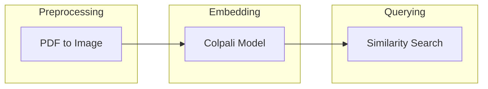

## IntelligentInvoiceAuditor Architecture Analysis

This analysis examines the `IntelligentInvoiceAuditor` repository based on the provided information.  The code snippets suggest a system for processing and querying invoices using embeddings generated from a Colpali model. However, the lack of a complete codebase and a description limits the depth of the analysis.

**1. System Architecture Overview**

The system appears to consist of the following main components:

* **Invoice Preprocessing:**  This component handles the intake of invoice documents (likely PDFs), converting them into a suitable format (e.g., images) for the embedding generation process.  Libraries like `pdf2image` are used for this purpose.
* **Embedding Generation:** This core component uses the `colpali_engine` library and its `ColQwen2` model to generate embeddings representing the semantic content of the invoices. This involves likely using a vector database for storage and querying.
* **Querying and Retrieval:**  This component allows users to query the system with text-based or image-based queries. The system then retrieves relevant invoices based on the similarity of their embeddings to the query embedding. The `ColQwen2Processor` likely plays a role here.
* **External Services:**  The use of `openai` suggests potential interaction with external large language models (LLMs) for tasks like question answering or further semantic analysis.


**Data Flow:**

1. Invoice Document -> Invoice Preprocessing -> Images/Text Representation
2. Images/Text Representation -> Embedding Generation -> Invoice Embeddings
3. Invoice Embeddings -> Vector Database
4. User Query -> Querying and Retrieval -> Query Embedding
5. Query Embedding -> Vector Database -> Relevant Invoice Embeddings -> Results


**Architectural Patterns:**

The system employs a pipeline architecture, where data flows sequentially through different processing stages. It also leverages the embedding approach, a common pattern in information retrieval systems.


**2. Technology Stack Analysis**

* **`colpali_engine`:** This is the core library for embedding generation. Its suitability depends on the performance and accuracy requirements.  Without knowing the specific model, we can't fully assess its appropriateness.
* **`transformers`, `torch`:** These are standard deep learning libraries, well-suited for the task.
* **`PIL`:**  Used for image processing.  A solid choice.
* **`pdf2image`:** Used for PDF conversion. A reasonable choice.
* **`openai`:**  Suggests reliance on external LLM services. This introduces vendor lock-in and cost considerations.
* **`pymilvus` (implied):**  Likely used for vector database management.  A good option, but other vector databases (e.g., FAISS, Weaviate) could be considered.

**Technology Debt:**

* **Dependency Management:** The repetitive installation of libraries across multiple files suggests poor dependency management. This should be centralized.
* **Hardcoded Dependencies:**  Specific library versions aren't explicitly defined, leading to potential reproducibility issues.
* **Missing Documentation:** The lack of descriptions and comments makes the code difficult to understand and maintain.


**Modern Alternatives:**

* Replace scattered `pip install` commands with a `requirements.txt` file.
* Consider using a more comprehensive vector database with better features (e.g., filtering, advanced querying).


**3. Component Dependencies**

The components are relatively tightly coupled.  The `generateembeddingsandquery.py` and `colpali_scratch_version_hs.py` files both appear to perform similar functions. This should be refactored.

**Decoupling Strategies:**

* **Modularization:** Separate concerns into distinct modules (e.g., a preprocessing module, an embedding module, a querying module).
* **Interfaces:** Define clear interfaces between modules to reduce dependencies.
* **Dependency Injection:** Use dependency injection to provide modules with their dependencies, making them more flexible and testable.


**4. Scalability Assessment**

Scalability is limited by several factors:

* **Single-Machine Processing:** The code suggests that all processing happens on a single machine.
* **Vector Database Scalability:** The choice of vector database (if any) impacts scalability.  `pymilvus` offers scaling capabilities, but their effectiveness needs to be evaluated based on expected data volume.

**Scaling Strategies:**

* **Distributed Processing:**  Distribute the embedding generation and querying processes across multiple machines using frameworks like Apache Spark or Dask.
* **Scalable Vector Database:** Use a distributed vector database (e.g., Weaviate, Milvus) designed for large-scale deployments.
* **Microservices Architecture:**  Break down the system into smaller, independent microservices to improve scalability, resilience, and maintainability.


**5. Architecture Diagrams**

**System Architecture (Mermaid):**

```mermaid
graph LR
    A[Invoice Documents] --> B(Invoice Preprocessing);
    B --> C(Embedding Generation);
    C --> D{Vector Database};
    E[User Query] --> F(Querying & Retrieval);
    F --> D;
    D --> G[Results];
    C -.-> H[OpenAI (Optional)];
```

**Component Interaction (Mermaid - Simplified):**




**Actionable Next Steps:**

* **High Priority:**
    * Create a `requirements.txt` file.
    * Refactor the code into well-defined modules with clear interfaces.
    * Implement a comprehensive logging system.
    * Add detailed docstrings and comments to the code.
    * Choose a robust vector database and implement its integration.
* **Medium Priority:**
    * Evaluate the need for external LLM services (`openai`). Consider alternatives if not essential.
    * Explore distributed processing options if scalability becomes a concern.
    * Implement unit and integration tests.
* **Low Priority:**
    * Improve error handling and exception management.
    * Add monitoring and alerting capabilities.


This analysis provides a starting point. A more in-depth assessment requires a complete code review and a clear understanding of the system's requirements and performance goals.
