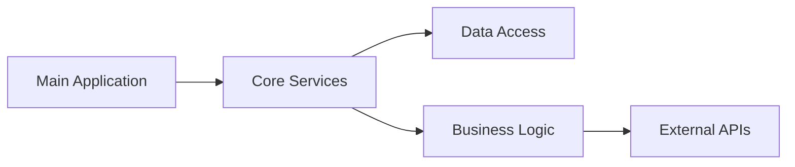

# Component Analysis - IntelligentInvoiceAuditor

## Component Relationships

### Identified Components

### Core Components
1. **IntelligentInvoiceAuditor**: Main application entry point
2. **Business Logic**: Core functionality implementation
3. **Data Access**: Data persistence and retrieval
4. **Configuration**: Application settings and environment variables

### Support Components
- **Utilities**: Helper functions and shared logic
- **Models**: Data models and structures
- **Services**: External service integrations

### Dependency Mapping

## Component Details

## Main Application Component
- **Language**: Python
- **Size**: 0MB
- **Type**: web-application

## Dependencies
- External dependencies managed through package management
- Framework dependencies for Python
- Development dependencies for testing and build tools

## Architecture Patterns
- **Pattern**: Layered architecture pattern
- **Structure**: web-application

## Recommendations
- Implement dependency injection for better testability
- Consider separating concerns with proper layering
- Add interface abstractions for external dependencies
