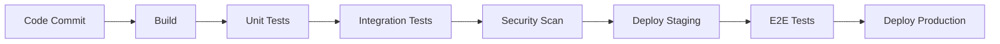

# CI/CD Pipeline Analysis - IntelligentInvoiceAuditor

## Current Pipeline Status

### Current CI/CD Status
- **Pipeline**: No CI/CD configuration detected
- **Build Automation**: Manual build process
- **Testing Integration**: No automated testing
- **Deployment**: Manual deployment process

### Immediate Needs
- Set up automated build pipeline
- Integrate testing into CI process
- Configure deployment automation
- Add security scanning to pipeline

## Recommended Pipeline Architecture

## Pipeline Stages

### 1. Build Stage
- Source code compilation
- Dependency installation
- Asset optimization

### 2. Test Stage
- Unit test execution
- Integration test running
- Code coverage reporting

### 3. Security Stage
- Vulnerability scanning
- Code quality analysis
- Dependency audit

### 4. Deployment Stage
- Staging deployment
- Production deployment
- Rollback capability

## Recommended Tools
- **CI/CD Platform**: GitHub Actions, GitLab CI, or Azure DevOps
- **Container Registry**: Docker Hub, Azure Container Registry
- **Deployment**: Kubernetes, Azure App Service, AWS ECS

## Implementation Plan
1. Set up basic CI pipeline
2. Add automated testing
3. Implement security scanning
4. Configure deployment automation
5. Add monitoring and alerting
