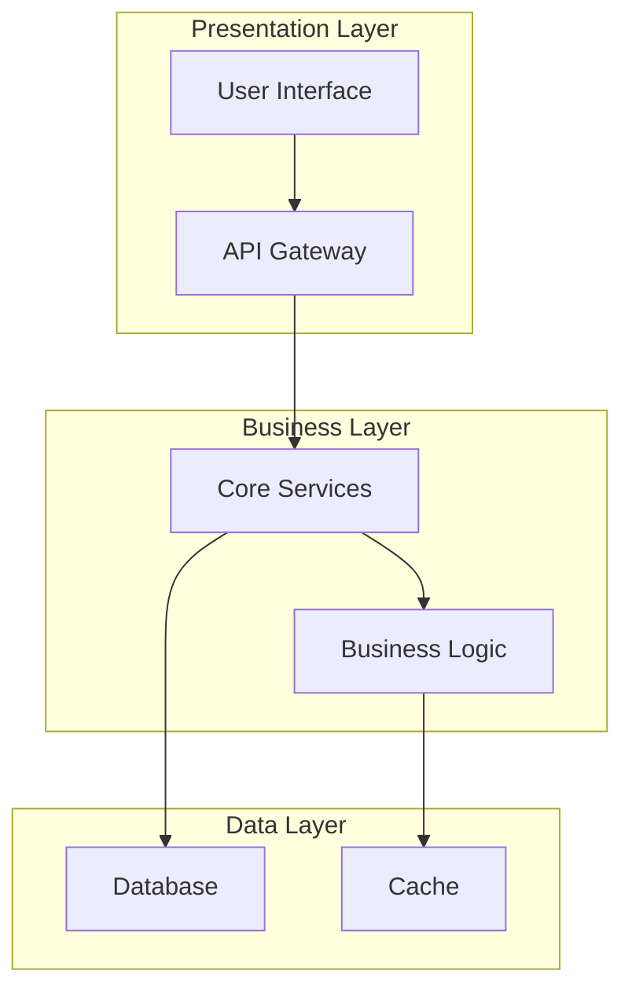

# High-Level Design - IntelligentInvoiceAuditor

## System Overview
System description not available

## Architecture Overview

## System Components

### Primary Components
1. **Application Core**
   - Main business logic implementation
   - User interface components
   - Data processing modules

2. **Data Management**
   - Data persistence layer
   - Cache management
   - Data validation and transformation

3. **Integration Layer**
   - External API connections
   - Third-party service integrations
   - Communication protocols

### Supporting Infrastructure
- Configuration management
- Error handling and logging
- Security and authentication

## Data Flow
1. User interaction through presentation layer
2. Request processing in business layer
3. Data persistence in data layer
4. Response delivery back to user

## Technology Stack
- **Primary Language**: Python
- **Framework**: Django/Flask/FastAPI
- **Database**: Database analysis required - recommend PostgreSQL/MySQL for relational data
- **Architecture Pattern**: Layered architecture pattern

## Design Principles
- **Separation of Concerns**: Clear layer separation
- **Single Responsibility**: Each component has one purpose
- **Dependency Inversion**: Abstract dependencies
- **Scalability**: Designed for horizontal scaling

## Quality Attributes
- **Performance**: Response time < 200ms
- **Availability**: 99.9% uptime target
- **Scalability**: Support for increasing load
- **Maintainability**: Clean, documented code
