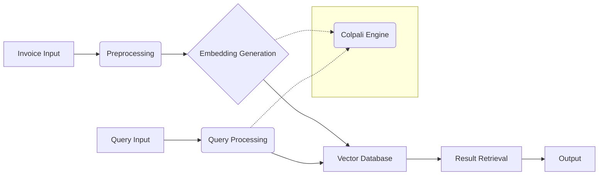

## IntelligentInvoiceAuditor: High-Level Design Analysis

This analysis assesses the `IntelligentInvoiceAuditor` repository based on the provided information.  The repository appears to be a work in progress focused on processing invoices using the `colpali-engine` library, likely for embedding generation and querying.  The lack of a clear description and incomplete code snippets hinder a complete analysis, but we can extrapolate a reasonable HLD.

**1. System Design Overview:**

The system aims to process invoices (likely PDF documents) to extract key information and potentially perform semantic search.

**System Architecture:**

**System Boundaries and Interfaces:**

* **Input:**  PDF invoices.  The system needs a clear interface for accepting invoice files (e.g., file upload, API endpoint).
* **Output:**  Extracted information from invoices (e.g., invoice number, date, amount, vendor), search results based on queries. The output should be well-defined (e.g., JSON, structured text).
* **External Dependencies:** `colpali-engine`, `transformers`, `pdf2image`, `openai`, `qwen_vl_utils`, `pymilvus` (or similar vector database).

**2. Component Design:**

* **Invoice Preprocessing Component:** Handles PDF parsing, image extraction (if needed), text cleaning, and potentially OCR.
* **Embedding Generation Component:** Uses `colpali-engine` to generate embeddings for the preprocessed invoice data.
* **Vector Database Component:** Stores the invoice embeddings and metadata (invoice ID, relevant information).  `pymilvus` is a likely candidate.
* **Query Processing Component:** Processes user queries, generates query embeddings using `colpali-engine`, and searches the vector database.
* **Result Retrieval Component:**  Retrieves and formats the search results.

**Component Interactions:**  The components interact sequentially as depicted in the system architecture diagram.

**3. Data Architecture:**

**Data Models:**

* **Invoice Metadata:**  `invoice_id`, `date`, `vendor`, `total_amount`, ... (Schema to be defined based on the required information)
* **Invoice Embeddings:**  A high-dimensional vector representing the semantic meaning of the invoice content (dimensionality depends on the embedding model).

**Data Storage Strategies:**

* **Vector Database:**  Milvus (or similar) for efficient similarity search of embeddings.
* **Metadata Database:**  PostgreSQL or similar relational database for structured invoice metadata.  Consider using a NoSQL database if schema flexibility is crucial.

**Data Flow Patterns:**

* Batch Processing:  For large-scale invoice processing.
* Real-time Processing:  For immediate query results (requires careful optimization).

**4. API Design:**

**API Architecture Patterns:** RESTful API

**API Endpoints (Examples):**

* `/invoices`: POST (upload invoice), GET (list invoices)
* `/invoices/{invoice_id}`: GET (retrieve invoice details)
* `/search`: POST (submit a search query)

**API Versioning:** Semantic versioning (e.g., v1, v2).

**API Documentation:**  Swagger/OpenAPI specification.

**5. Design Patterns:**

* **Model-View-Controller (MVC):**  For structuring the application logic.
* **Repository Pattern:**  For abstracting data access.
* **Dependency Injection:** For managing dependencies.

**Actionable Next Steps:**

* **High Priority:**
    * Define a clear project scope and requirements.  What specific information needs to be extracted? What types of queries are supported?
    * Complete the code implementation. Address the incomplete code snippets and missing functionalities.
    * Implement robust error handling and logging.
    * Choose and configure a vector database (e.g., Milvus).
    * Design and implement a well-defined API.
    * Write comprehensive unit and integration tests.

* **Medium Priority:**
    * Explore different embedding models and optimize for accuracy and performance.
    * Implement a user interface (optional, depending on the requirements).
    * Investigate techniques for handling noisy or ambiguous invoice data.

* **Low Priority:**
    * Explore deployment options (e.g., cloud, on-premise).
    * Implement advanced features like data visualization or anomaly detection.

This analysis provides a starting point for developing a robust and scalable `IntelligentInvoiceAuditor`.  The next steps, prioritized above, should be addressed to build a functional and maintainable system.  The incomplete nature of the provided code prevents a more detailed analysis of specific implementation choices.  Further details regarding data schemas, specific API specifications, and error handling strategies will be needed as the project progresses.
