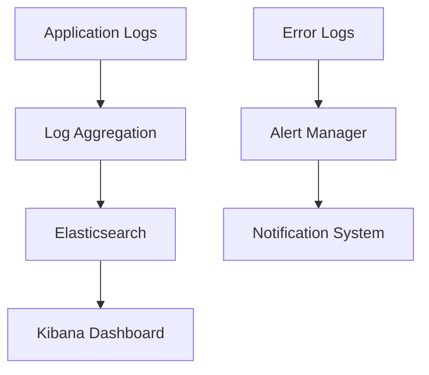

# Monitoring Tools Analysis - IntelligentInvoiceAuditor

## Current Monitoring Setup

### Current Status
- **Monitoring Tools**: Not detected in repository
- **Logging**: Basic application logging recommended
- **Metrics**: No custom metrics implementation found
- **Alerting**: No alerting infrastructure detected

### Recommendations Needed
- Implement application performance monitoring
- Set up structured logging
- Add custom business metrics
- Configure alerting for critical issues

## Recommended Monitoring Stack

### Application Monitoring
- **APM Solution**: New Relic, DataDog, or Application Insights
- **Metrics**: Custom business metrics and KPIs
- **Alerting**: Critical error rates, performance degradation

### Infrastructure Monitoring
- **System Metrics**: CPU, Memory, Disk, Network
- **Container Monitoring**: Docker/Kubernetes metrics
- **Cloud Monitoring**: AWS CloudWatch, Azure Monitor

### Logging Strategy

## Implementation Roadmap
1. **Structured Logging**: Implement consistent log format
2. **Metrics Collection**: Add application metrics
3. **Dashboard Creation**: Build monitoring dashboards
4. **Alert Configuration**: Set up critical alerts

## Observability Pillars
- **Logs**: Structured application and system logs
- **Metrics**: Performance and business metrics
- **Traces**: Request tracing for distributed systems
